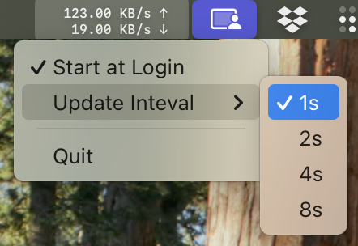

# NetSpeedMonitor

Just a minimal menu bar macOS app.

It runs `sysctl` with c interface in a repeating timer.

Use at your own risk.

# Functions

1. Start at login
2. Set different update intevals, now with 4 options: 1s, 2s, 4s, 8s.

# Screenshot

