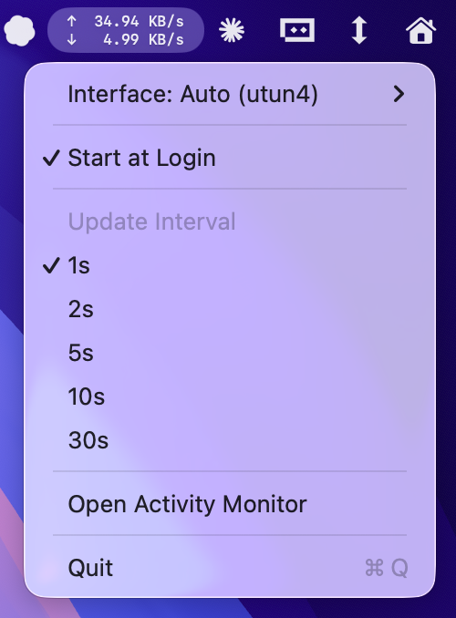

# NetSpeedMonitor

NetSpeedMonitor is a minimal menu bar app for macOS 26 and later. It reads per-interface byte counters with `sysctl` and displays current upload and download rates.

## Features

1. Start at login.
2. Choose an update interval from 1 to 60 seconds with a multi-stop slider.
3. Open Activity Monitor directly from the menu.
4. Automatically follow the effective network interface when a VPN connects or disconnects.
5. Inspect all active interfaces or pin the display to a specific interface.
6. Check for, download, verify, and install GitHub releases in the app.
7. View the current version, project link, and author from About.

## Install

1. Download `NetSpeedMonitor.zip` from the latest GitHub release.
2. Unzip it and move `NetSpeedMonitor.app` to `/Applications`.
3. Open the app. If macOS blocks the ad-hoc signed build, run:

```bash
sudo xattr -rd com.apple.quarantine /Applications/NetSpeedMonitor.app
```

To upgrade, choose **Check Update** from the NetSpeedMonitor menu. If the in-app updater cannot run, quit NetSpeedMonitor and replace the existing app in `/Applications` manually.

## VPN Behavior

Automatic mode asks the macOS Network framework which interface carries traffic to a public IPv4 endpoint. This follows full-tunnel and route-based VPN changes without polling. Split-tunnel VPNs can route different destinations over different interfaces, so no single interface can represent every flow.

Per-process traffic monitoring is intentionally not included because continuously running `nettop` has significantly higher CPU overhead.

## Screenshot


