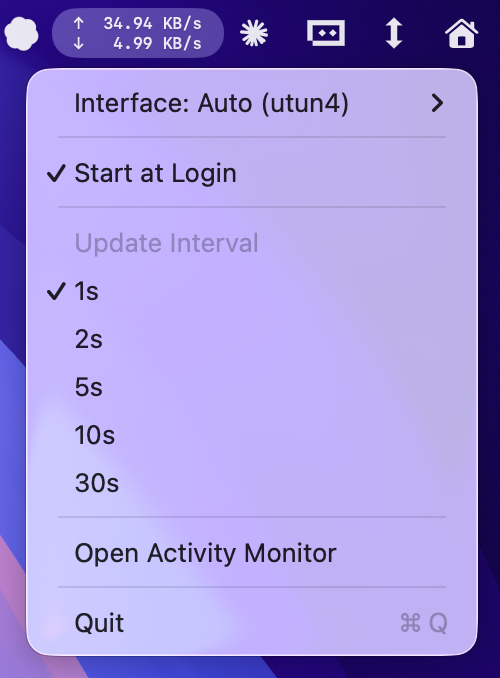

# NetSpeedMonitor

NetSpeedMonitor is a minimal menu bar app for macOS 26 and later. It reads per-interface route counters directly from NetworkStatistics, falls back to BSD interface counters when needed, and displays current upload and download rates.

## Features

1. Start at login.
2. Choose an update interval from 1 to 60 seconds with a multi-stop slider.
3. Open Activity Monitor directly from the menu.
4. Automatically follow the effective network interface when a VPN connects or disconnects.
5. Inspect all active interfaces or pin the display to a specific interface.
6. Check for, download, verify, and install GitHub releases in the app.
7. Choose whether update checks include GitHub pre-releases. The default channel only checks official releases.
8. View the current version, project link, and author from About.
9. Choose upload/download visibility and byte- or bit-based units.
10. View bounded session history, peak rates, and transferred totals.
11. Reduce polling frequency automatically in Low Power Mode and reset stale samples after wake.

## Install

1. Download `NetSpeedMonitor.zip` from the latest GitHub release.
2. Unzip it and move `NetSpeedMonitor.app` to `/Applications`.
3. Open the app. If macOS blocks the ad-hoc signed build, run:

```bash
sudo xattr -rd com.apple.quarantine /Applications/NetSpeedMonitor.app
```

To upgrade, choose **Check Update** from the NetSpeedMonitor menu. If the in-app updater cannot run, quit NetSpeedMonitor and replace the existing app in `/Applications` manually.
Automatic installation is supported when the app is located directly in `/Applications` or `~/Applications`.

## Versioning

Releases use `MAJOR.MINOR.PATCH`. Increment `MAJOR` for incompatible changes, `MINOR` for new features, and `PATCH` by default for fixes and maintenance changes.

## Release signing

Official update archives are signed with an Ed25519 private key. The matching public key is pinned in the application and in `scripts/verify-release.swift`; the updater rejects releases without a valid `NetSpeedMonitor.sig`. To verify an official archive independently:

```bash
xcrun swift scripts/verify-release.swift v1.22.1 NetSpeedMonitor.zip NetSpeedMonitor.sig
```

The release private key is stored outside the repository and in the `RELEASE_SIGNING_PRIVATE_KEY_BASE64` GitHub Actions secret. GitHub secrets are write-only: their plaintext cannot be downloaded later. Maintainers must keep a separate encrypted backup. To rotate the key, first ship a release signed by the old key that trusts both old and new public keys, then sign later releases with the new key.

For local signing, keep the Base64-encoded 32-byte private key at `~/.config/NetSpeedMonitor/release-signing-private-key.base64` with mode `0600`. Back this file up in a trusted password manager or encrypted removable storage; never commit or upload it as a repository artifact.

## VPN Behavior

Automatic mode resolves which interface carries traffic to a public IPv4 endpoint on every refresh and also reacts to macOS Network path changes. This makes the selected interface follow VPN connect, disconnect, and mode changes without restarting the app.

Traffic rates come from direct NetworkStatistics route queries. Active IPv4 and IPv6 route sources are aggregated by interface while duplicate dynamic route clones are excluded, including full-tunnel VPNs that represent the default path as multiple route prefixes. If NetworkStatistics is unavailable, the app uses BSD interface counters as a fallback. Split-tunnel VPNs can route different destinations over different interfaces, so automatic mode follows the public probe route while the interface submenu continues to expose the other active interfaces.

The app does not launch or continuously run `nettop`; that approach has significantly higher CPU overhead.

## Screenshot


